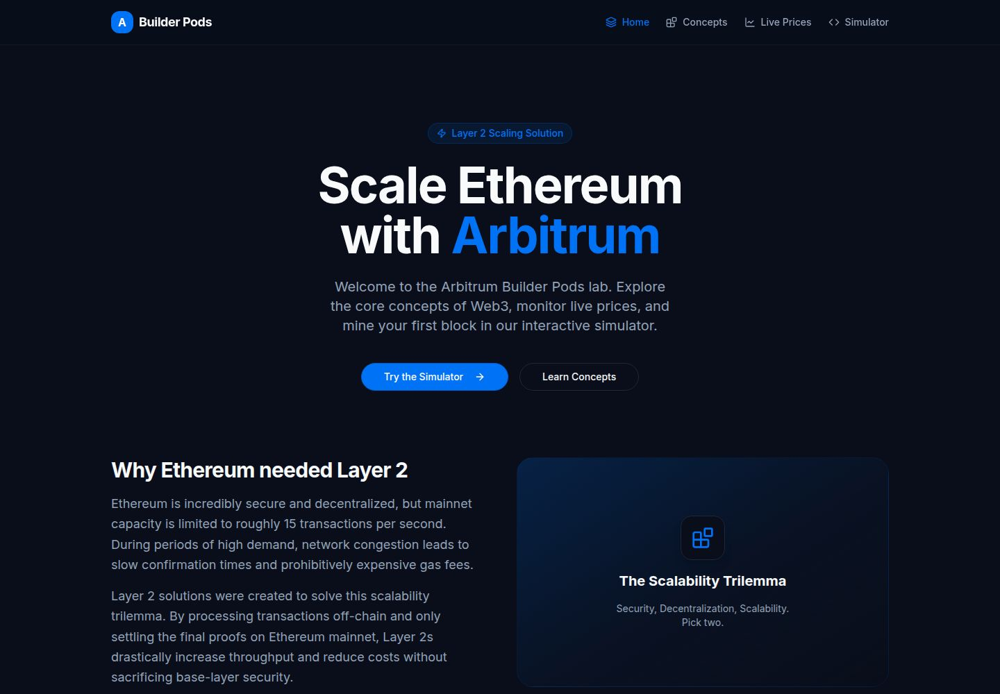
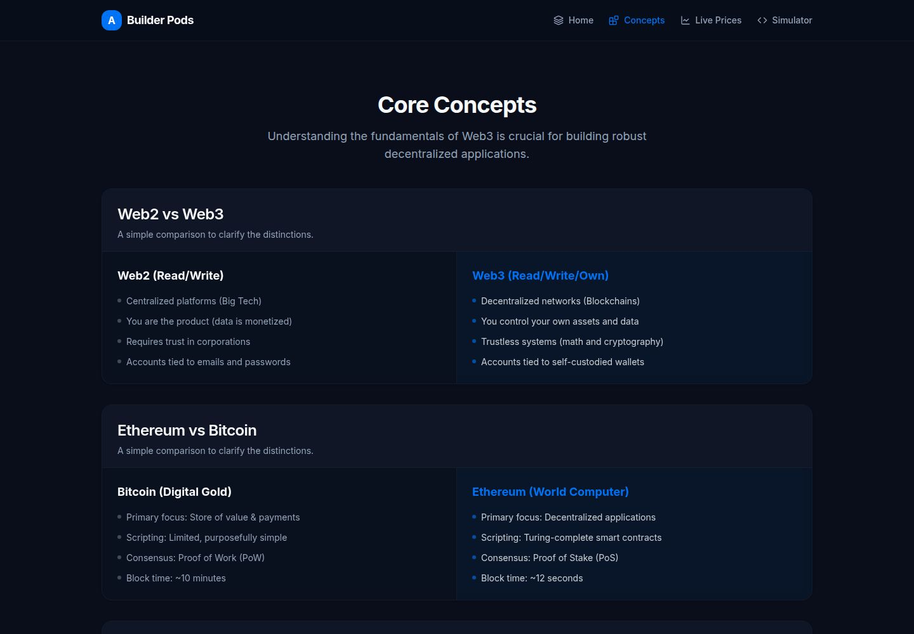
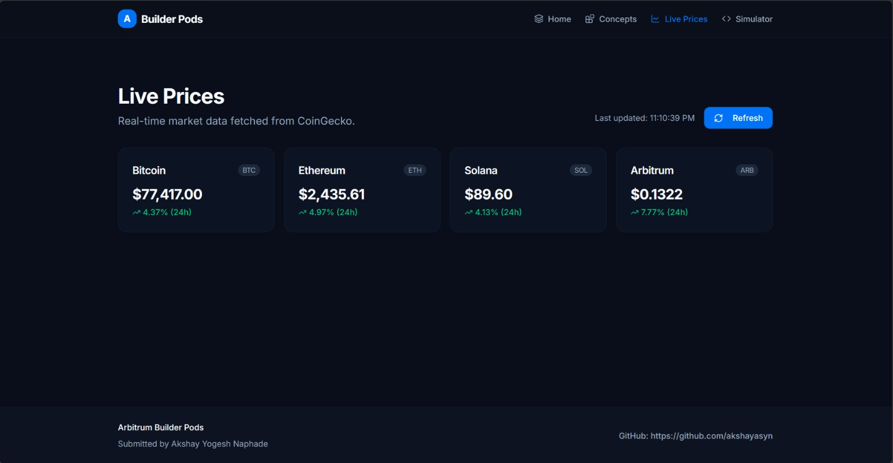
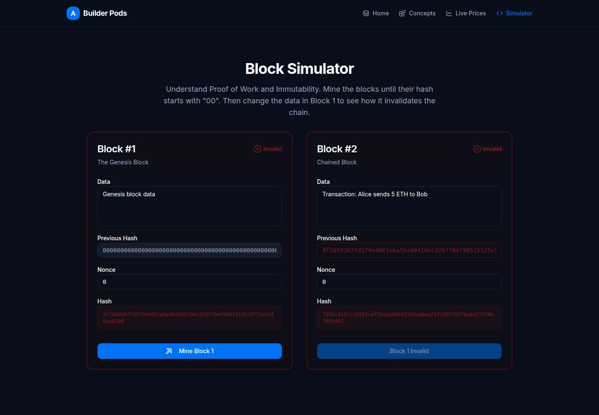

# Arbitrum Builder Pods Assignment

A polished educational Web3 mini-site builder collaboration platform built with React, TypeScript, Vite, and Tailwind. 
This was built as part of the Arbitrum Builder Pods curriculum. 
It serves as an interactive learning lab for understanding blockchain concepts and Layer 2 solutions.

## Pages

1. **Home (`/`)**: An introduction to Layer 2 scaling and Arbitrum. Explains the scalability trilemma and why solutions like Arbitrum are necessary for Ethereum's mass adoption.
2. **Concepts (`/concepts`)**: Clear, concise comparison cards outlining fundamental Web3 differences: Web2 vs Web3, Bitcoin vs Ethereum, Public vs Private Keys, and Blockchain vs Traditional Databases.
3. **Live Prices (`/prices`)**: Fetches real-time price data for major cryptocurrencies (BTC, ETH, SOL, ARB) via the public CoinGecko API. Includes 24h change indicators and manual refresh capabilities.
4. **Simulator (`/simulator`)**: An interactive blockchain mining simulator. Users can mine two connected blocks by finding a nonce that produces a valid SHA-256 hash starting with "00". Modifying the genesis block immediately invalidates the connected block, practically demonstrating chain immutability.

## Installation & Running Locally

1. Clone or download the repository.
2. Ensure you have Node.js installed.
3. Open a terminal in this project folder.
4. Run `npm install`.
5. Run `npm run dev` to start the local Vite development server.
6. Open your browser to the local URL provided, usually `http://localhost:5173`. (Set as default).

## Known Issues / Improvements

- **CoinGecko API Limits**: The free tier of CoinGecko API is heavily rate-limited. If you refresh too often, you may encounter an error state. An improvement would be to add a caching layer or fallback endpoint.
- **Mining Thread Blocking**: The simulator currently uses a chunked asynchronous loop to prevent completely freezing the browser tab while calculating hashes, but on very slow devices it may still cause brief UI stuttering. Moving the SHA-256 calculation to a Web Worker would be the ideal production fix.
- **Theme Support**: The site is currently configured primarily around a Web3 "Dark Mode" aesthetic. Implementing a fully robust light mode toggle would be a nice UI addition.

## Screenshots

### Home

### Concepts

### Prices

### Simulator

